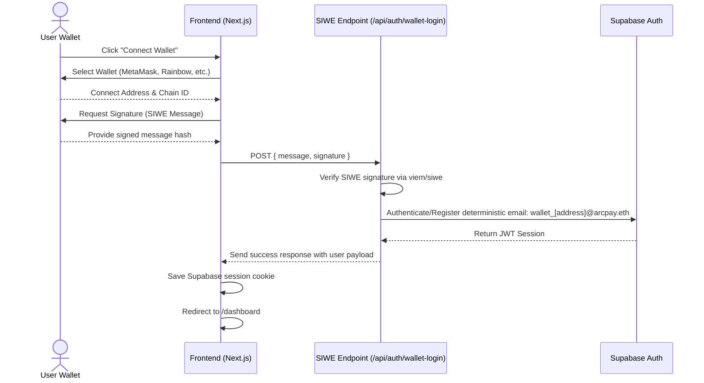

# ⚡ ArcPay - Web3 P2P Payment Gateway & Wallet

ArcPay is a modern, high-fidelity Web3 peer-to-peer payment gateway and platform built for the **Arc Network**. By combining state-of-the-art **RainbowKit** connection, **Sign-In with Ethereum (SIWE)** backend authentication, and a secure **Supabase** backend, ArcPay offers a seamless, gasless transaction experience on the Arc Testnet.

---

## ✨ Features

- **🌐 Web3-Native Connection:** Integrated with **RainbowKit** and **Wagmi** for a smooth, plug-and-play wallet connection experience.
- **🔐 Secure SIWE Authentication:** Implements the **Sign-In with Ethereum (EIP-4361)** standard to verify ownership of wallet addresses on the backend and seamlessly establish authenticated Supabase sessions.
- **🚀 Arc Testnet & Gasless Transactions:** Built specifically to leverage the **Arc Testnet (Chain ID: 5042002)**, offering supercharged transactions with USDC.
- **💎 Premium Dark UI:** Crafted with a high-fidelity glassmorphism aesthetic, sleek micro-animations, customizable responsive sizing, and vibrant blue/purple glow effects.
- **⚡ Real-time Synchronization:** Utilizes Supabase Realtime to push immediate updates for payments, invoice creation, and wallet balances.
- **📜 Smart Contract Integration:** Interactive transaction mechanics utilizing Ethers/Viem to sign payloads directly from connected EOAs.

---

## 🛠️ Technology Stack

- **Framework:** [Next.js 15+ (App Router)](https://nextjs.org/)
- **Wallet Connection:** [@rainbow-me/rainbowkit](https://www.rainbowkit.com/) & [Wagmi / Viem](https://wagmi.sh/)
- **State Management:** [@tanstack/react-query](https://tanstack.com/query)
- **Database & Auth:** [Supabase](https://supabase.com/)
- **Theme & Styles:** [Tailwind CSS](https://tailwindcss.com/) & [shadcn/ui](https://ui.shadcn.com/)
- **Icons & Alerts:** [Lucide React](https://lucide.dev/) & [Sonner](https://github.com/emilkowalski/sonner)

---

## 🚀 Getting Started

### 📋 Prerequisites

- **Node.js v20+**
- **npm** or **bun**
- A **WalletConnect Project ID** (Obtained from [WalletConnect Cloud](https://cloud.walletconnect.com/))
- A **Supabase Project** (Local or Cloud instance)

### ⚙️ Installation & Setup

1. **Clone the repository:**
   ```bash
   git clone git@github.com:linoxbt/memeautonom.git
   cd memeautonom/arcpay
   ```

2. **Install dependencies:**
   ```bash
   npm install
   ```

3. **Configure Environment Variables:**
   Create a `.env.local` file in the root of the `arcpay` directory:
   ```env
   # Supabase Credentials
   NEXT_PUBLIC_SUPABASE_URL=https://your-supabase-project.supabase.co
   NEXT_PUBLIC_SUPABASE_ANON_KEY=your-supabase-anon-key

   # Web3 Configuration
   NEXT_PUBLIC_WALLETCONNECT_PROJECT_ID=your-walletconnect-project-id
   ```

4. **Start the Development Server:**
   ```bash
   npm run dev
   ```
   Open [http://localhost:3000](http://localhost:3000) in your browser to interact with the application.

---

## 🔒 Authentication Flow (SIWE Architecture)

To secure database queries and enforce Row-Level Security (RLS) without requiring cumbersome email/password sign-ups, ArcPay utilizes an optimized SIWE bridge:



---

## 📖 Available Documentation

For a comprehensive guide on building, deploying, testing, and integrating with the ArcPay SDK, refer to our interactive **Docs Page** built directly into the app:
- Access locally at `/docs` (or via the UI navigation sidebar).
- Read the API and smart contract interfaces.

---

## 📄 License & Attributions

Developed by **linoxbt**. Powered by **Circle Developer Platform** and **Arc Network**.
Distributed under the Apache-2.0 License.
